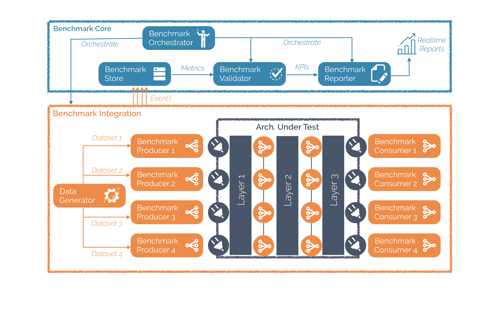

# BDBench
Big Data Decisional Benchmark 

## BDBench Installation 

### Requirements 

 -  Java 1.8

### Steps 

1. Install **Ansible** :

http://docs.ansible.com/ansible/latest/installation_guide/intro_installation.html

2. Active the Remove Session in your Mac Configuration

`Préférences Système > Partage > Coche "Session à distance"`

3. create your ssh public key :

`ssh-keygen`

4. add your public Key to your Host 

`ssh-copy-id localhost`

5. test Ansible Installation 

`ansible localhost -m ping`

6. BDBench Installation, from BDBench/benchmark-installation-orchestration :

`ansible-playbook ./install.yml`

7. Start BDBench, from BDBench/benchmark-installation-orchestration :

`ansible-playbook ./start.yml`
