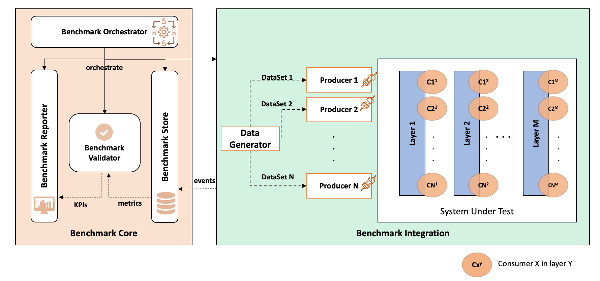
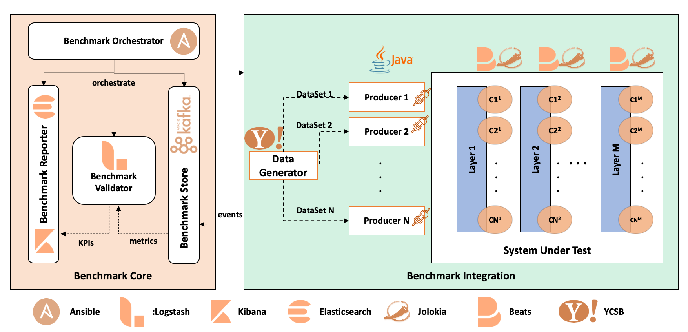
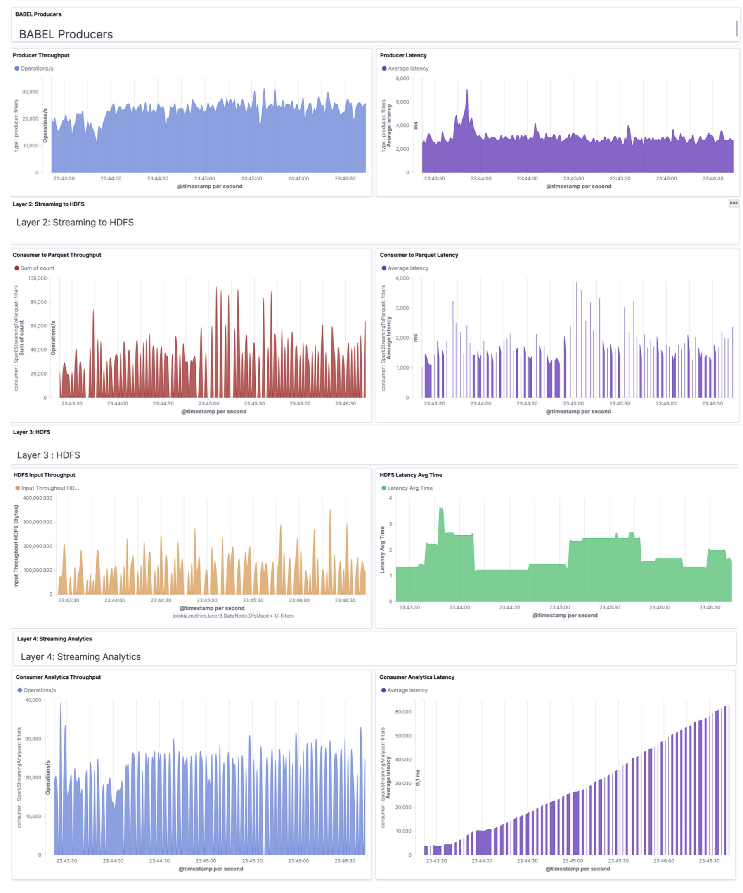

# BABEL

**B**ig d**A**ta **BE**nchmarking p**L**atform, a generic, architecture-level and scalable benchmarking platform, destined to the real-time collection, analytics and reporting of data and events shared between the layers of complex Big Data applications.

*Benchmark name is inspired from the myth of the Tower of BABEL, used to justify the origin of the presence of multiple spoken languages.*


# Features 

The main **features** of BABEL: 
- **Genericity**: technology-, application- and architecture-agnostic. 
- **Dynamicity**: runs in parallel with the system, without interfering with its behavior, and with negligible overhead.
- **Adaptability**: adapts to any number of layers in the Big Data application, as well as to any type of data and workloads.
- **Multi-Paradigm**: able to benchmark streaming and batch processing systems, as well as operational and decisional platforms.
- **End-to-End Solution**: evaluates the behavior of the whole system, by measuring application- and system-level metrics.
- **Real-time Reporting**: offers a real-time reporting layer, that illustrates the system's metrics on the fly.
- **Distribution and Scalability**: configurable, and offer a  scalable collection, processing engines and  storage, in order to enable the continuous archiving of metrics for a better analysis.
- **Agility**: flexible during the different integration phases and also at run-time, new layers, metrics, and processing jobs can be added on the fly.

# Benchmark Architecture



# Technical Architecture



# Getting Started with BABEL:

1. Check if the default data generator and Workloads are enough for your needs, or develop your own by extending the following abstract classes: **Generator<V>** and **Workload**.
2. Create your **inventory** describing the SUT and BABEL nodes (inventory example below).
3. Specify the configuration and architecture parameters in the **group\_vars** files by defining : 
  - **Workload** : parallelism level, number of fields and records, etc.
  - **Data Generator**, **consumers** and **producers** configuration
  - **SUT environment** : servers addresses, number of layers, resources name like tables, topics, queues, etc.
  - **BABEL** installation parameters

4.install and init the different benchmark components by using the existing Ansible playbooks that will use the defined variables. (as described in the installation section below)


# Installation 

## Requirements 

 -  JDK 1.8
 -  Ansible 

## Steps 
### Ansible and JDK Deployment  


1. Install **Ansible** :

http://docs.ansible.com/ansible/latest/installation_guide/intro_installation.html

2. Enable the Remote Session if you use MacOS for tests

3. Install JDK 1.8

### BABEL Deployment

1. Clone the BABEL project from Github

`git clone https://github.com/mehdibn/BABEL.git`

2. Configure your produce by extending the java abstract class **tn.lipsic.babel.adapters.GenericProducer**

3. Create your own BABEL deployment in the **benchmark-installation-orchestration** module 

4. Configure the **inventory** with the different groups:

- Benchmark Core Nodes

```
[elasticsearch-nodes]
elastic-node-1
elastic-node-2
elastic-node-3

[logstash-nodes]
logstash-node-1
logstash-node-2
logstash-node-3

[kibana-nodes]
kibana-node-1


[kafka-nodes]
kafka-node-1
kafka-node-2
kafka-node-3

[babel-nodes]
babel-node-1
babel-node-2
babel-node-3

[producer-nodes]
node1
node2
node3


```

- System Under Test Nodes

```

[sut]
sut-node-1
sut-node-2
sut-node-3
sut-node-4
sut-node-5
```

5. Define the different BABEL and SUT parameters in the **group_vars/all** file, e.g :

- Benchmark Core properties

```
# babel properties
# OS System  : linux | darwin
os_type : linux
parent_dir : /var/app
babel_install_parent_dir: '{{parent_dir}}/babel/'
babel_install_dir: '{{babel_install_parent_dir}}/{{babel_name}}'
babel_install_link_dir: '{{babel_install_parent_dir}}/babel'
babel_name : 'babel-{{babel_ver}}'
babel_ver : '1.0-SNAPSHOT'


#kafka
embedded_kafka: true
kafka_install_parent_dir: '{{parent_dir}}/kafka/'
kafkabrokers : 'host1:port, host2:port, host3:port'
zookeeperquorum : 'host1:port, host2:port, host3:port'
kafkarep: "3"

#elastic
embedded_elasticsearch: true
elasticsearch_install_parent_dir: '{{parent_dir}}/elasticsearch/'
elastic_coordinator : 'host1:port, host2:port, host3:port'

#logstash
embedded_logstash: true
logstash_install_parent_dir: '{{parent_dir}}/logstash/'

#kibana
embedded_kibana: true
kibana_install_parent_dir: '{{parent_dir}}/kibana/'
```

- System Under Test Properties

```
#SUT properties
#Metricbeat
metricbeat_install_parent_dir: '{{parent_dir}}/metricbeat/'

```

- Producer(s) Properties (with Kafka Example)

```
#Producer Properties described in the README of the benchmark-data-generation module
producer: 'tn.lipsic.integration.producers.KafkaProducer'
producerProperties: '-threads 5 -target 1000000'


# Properties of this var can be loaded in your producer implementation via the getProperties() method of the GenericProducer Abstract Class 
SUTProperties : 'SUTkafkabrokers=host1:port, host2:port, host3:port ; SUTtopic=kafkatopic ; SUTZookeeper=host1:port, host2:port, host3:port'
```

- Consumer Agent(s)  Properties (with Examples)


```
#Consumers properties
consumers_jolokia_agent:
  - id: "1"
    layer: "layer1"
    port: "7770"
    type: "Kafka"
    user: "kafka"
    metrics:
      - mbean: "kafka.server:name=MessagesInPerSec,topic={{ SUTtopic }},type=BrokerTopicMetrics"
        attr: "Count"
        field: "MessagesInPerSec"

  - id: "4"
    layer: "layer3"
    port: "7771"
    type: "DataNode"
    user: "hdfs"
    metrics:
      - mbean: "Hadoop:name=FSDatasetState,service=DataNode"
        attr: "DfsUsed"
        field: "DfsUsed"
      - mbean: "Hadoop:name=RpcActivityForPort8010,service=DataNode"
        attr: "RpcProcessingTimeAvgTime"
        field: "RpcProcessingTimeAvgTime"
```

- Embedded Consumer(s) Properties 


```
consumers_jolokia_embedded:
  - id: "2"
    layer: "layer2"
    port_executor: "7775"
    port_driver: "7772"
    type: "spark-streaming"
    metrics:
      - mbean: "java.lang:name=PS MarkSweep,type=GarbageCollector"
        attr: "CollectionTime"
        field: "gc.psms_collection_time"

  - id: "3"
    layer: "layer2"
    port_executor: "7776"
    port_driver: "7773"
    type: "spark-streaming"
    metrics:
      - mbean: "java.lang:name=PS MarkSweep,type=GarbageCollector"
        attr: "CollectionTime"
        field: "gc.psms_collection_time"

  - id: "6"
    layer: "layer4"
    port_executor: "7777"
    port_driver: "7774"
    type: "spark"
    metrics:
      - mbean: "java.lang:name=PS MarkSweep,type=GarbageCollector"
        attr: "CollectionTime"
        field: "gc.psms_collection_time"

```

6. from the benchmark-installation-orchestration module, install BABEL 

`ansible-playbook install.yml`

7. init BABEL 

`ansible-playbook init-balel-nodes.yml`

8. init SUT 

`ansible-playbook init-sut-nodes.yml`

9. start Producers 

`ansible-playbook start-producers.yml`

# Dashboard Example


