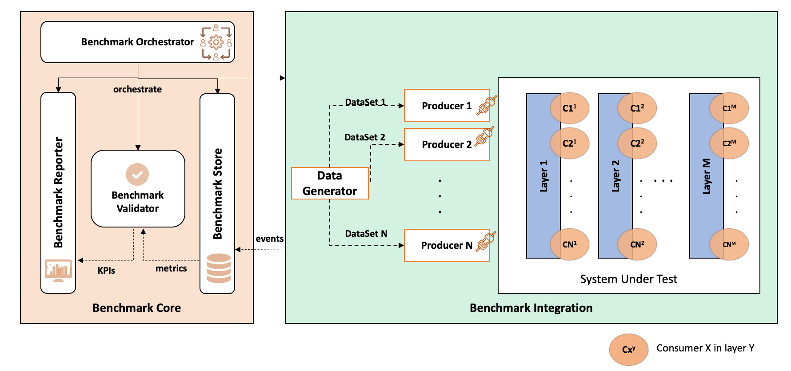
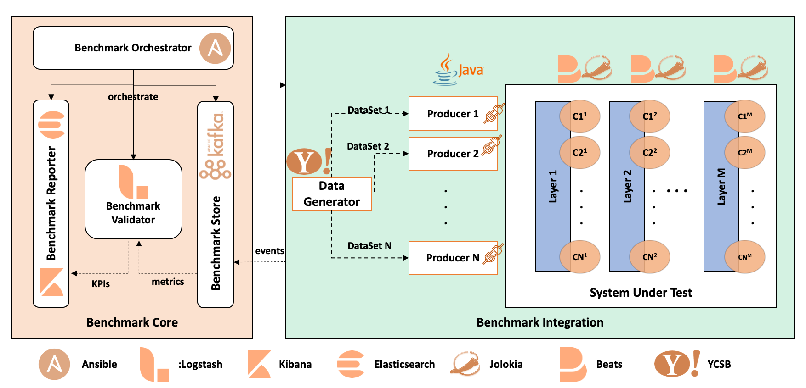

# BABEL
Benchmark name is inspired from the myth of the Tower of BABEL, used to justify the origin of the presence of multiple spoken languages.

**BABEL** : **B**ig d**A**ta **BE**nchmarking p**L**atform,  generic tool, defined by a set of interconnected components that are destined to work for any Big Data architecture. 

The main **features** of BABEL: 
- **Genericity**: It should be technology-, application- and architecture-agnostic. 
- **Dynamicity**: It should run in parallel with the system, without interfering with its behavior, and with negligible overhead.
- **Adaptability**: It must adapt to any number of layers in the Big Data application, as well as to any type of data and workloads.
- **Multi-Paradigm**: It should be able to benchmark streaming and batch processing systems, as well as operational and decisional platforms.
- **End-to-End Solution**: It needs to evaluate the behavior of the whole system, by measuring application- and system-level metrics.
- **Real-time Reporting**: It must offer a real-time reporting layer, that illustrates the system's metrics on the fly.
- **Distribution and Scalability**: It must be configurable, and offer a  scalable collection, processing engines and  storage, in order to enable the continuous archiving of metrics for a better analysis.
- **Agility**: The platform should be flexible: during the different integration phases and also at run-time, new layers, metrics, and processing jobs can be added on the fly.

# Benchmark Architecture

# Technical Architecture

